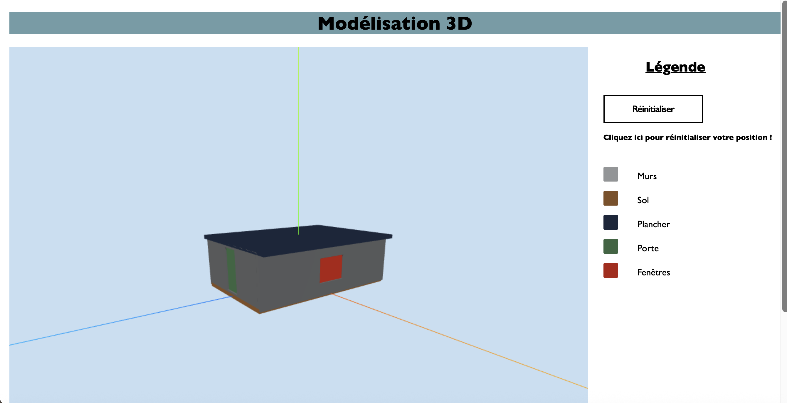

# Projet Maison 3D avec Angular & Three.js

## Description
Ce projet permet de visualiser une maison en 3D dans un navigateur web.  
Il utilise *Angular* pour la structure de l'application et *Three.js* pour le rendu 3D.  

Le projet inclut :  
- Création des murs avec portes et fenêtres.  
- Ajout d'un plancher et d'un sol.  
- Contrôles interactifs de la caméra avec OrbitControls.  
- Gestion des ombres et lumières pour un rendu réaliste.  

----

## Technologies utilisées
- Angular 19.2.15
- TypeScript  
- Three.js  
- three-csg-ts (pour les opérations CSG)  

----

## Installation
```bash
1. Cloner le projet :  
• git clone <https://github.com/charlottecordelle/Maison3D.git>

2. Installer les dépendances :
• npm install

3. Lancer le serveur Angular :
• ng serve

4. Ouvrir le projet dans le navigateur :
• http://localhost:4200 ou Raccourci : 'o' + 'Entrée'
```

----

## Pour contribuer :

1. Fork le projet

2. Crée une branche pour les modifications :
git checkout -b nom_de_la_branche

3. Commit les changements :
git commit -m "Ajout"

4. Push sur la branch crée :
git push origin nom_de_la_branche

5. Crée une Pull Request

----



**Aperçu de la maison 3D dans le navigateur**